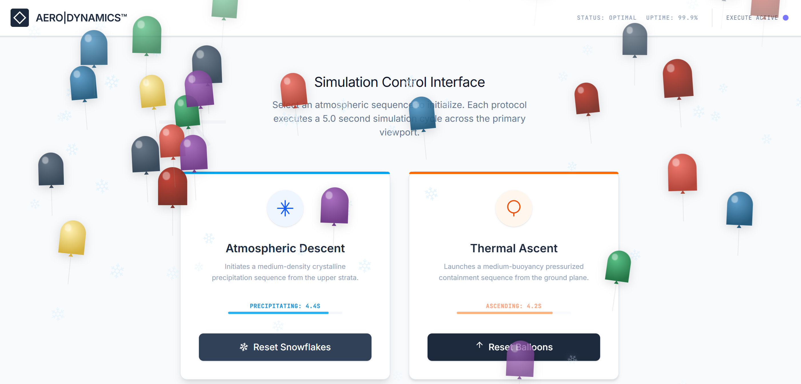

# Snowflakes and Balloons Effects

Interactive frontend application built with Google AI Studio, React and TypeScript.

This project demonstrates how AI-generated applications can be created, customized, deployed and managed using Google AI Studio and Google Cloud Run.

---

## Project Goal

The goal of this project is to gain hands-on experience with:

* Google AI Studio
* Prompt Engineering
* React applications
* TypeScript development
* Google Cloud Run
* Git and GitHub workflow

The project covers:

* AI-assisted frontend generation
* Interactive user interfaces
* Animation effects
* Cloud deployment
* Source code management
* Application publishing

---

## Technologies

* React
* TypeScript
* Vite
* Google AI Studio
* Google Cloud Run
* Git
* GitHub
* npm

---

## Architecture

```text
User
    │
    ▼
Google AI Studio
    │
    ▼
React Application
    │
    ▼
Cloud Run Deployment
```

---

## Application Features

The application provides:

* Snowflake animation effect
* Balloon animation effect
* Interactive control panel
* Countdown timer
* Responsive layout
* Professional dashboard interface

---

## Snowflakes Effect

The Snowflakes button activates:

* Medium-sized snowflakes
* Top-to-bottom animation
* Randomized movement
* 5-second duration

---

## Balloons Effect

The Balloons button activates:

* Medium-sized balloons
* Bottom-to-top animation
* Floating movement
* 5-second duration

---

## Application Screenshot



---

## Cloud Run Deployment

The project was successfully deployed to Google Cloud Run using Google AI Studio.

Deployment included:

* Application build
* Cloud Run publishing
* Public endpoint generation
* Deployment verification

The deployment was later removed according to the laboratory cleanup instructions.

---

## Running Locally

Install dependencies:

```bash
npm install
```

Run application:

```bash
npm run dev
```

Open:

```text
http://localhost:3000
```

---

## Repository Structure

```text
google-ai-studio-snowflakes-balloons
│
├── src/
│   ├── components/
│   │   ├── BalloonEffect.tsx
│   │   └── SnowflakeEffect.tsx
│   │
│   ├── App.tsx
│   ├── main.tsx
│   ├── index.css
│   └── types.ts
│
├── docs/
│   └── screenshots/
│       └── app.png
│
├── metadata.json
├── package.json
├── package-lock.json
├── tsconfig.json
├── vite.config.ts
└── README.md
```

---

## Learning Outcomes

Through this project I gained practical experience with:

* Google AI Studio
* Prompt Engineering
* React applications
* TypeScript development
* Cloud deployment
* Cloud Run services
* Git version control
* GitHub workflow

---

## Future Improvements

* Custom animation duration
* Adjustable particle size
* Additional animation effects
* Theme customization
* Mobile optimization
* Enhanced user controls
